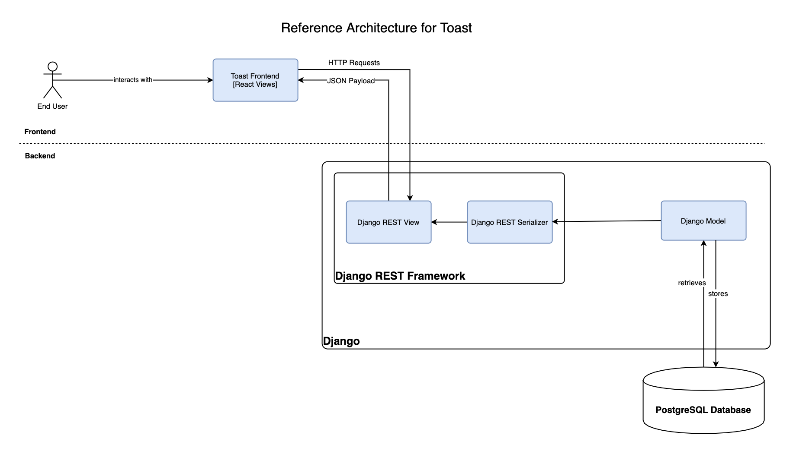

## Description of the Problem

The goal of this product is to provide an intuitive solution to automate financial planning that is currently manually done by the advisors. 
It will benefit the client by giving them an opportunity to have a more independent planning approach. 
One of the main deliverables is a consumable Rules as a Service API that will be used by the company for their internal financial wellness application. 
Toast will also have a user interface to showcase the functionality and features implemented.

## System Architecture
The following reference architecture represents the abstract architecture of the domain in the form of a diagram. 
It breaks down Toast as a software system into its constituent subsystems and highlights the relationship between these subsystems.

### Sub-systems
1) Frontend: React serves the user interface screens to the end user. The static resources needed are handled by the React static server. React also handles routing between different pages for client input and displays plan output. 
2) Middle-tier: Django REST Framework exposes the API endpoints that are consumed by React
3) Backend: The backend is built with Django. A model class is the single, definitive source of information about the data. It contains the essential fields and behaviors of the data you’re storing. Generally, each model maps to a single database table so a model can retrieve and store data in the database.
4) Database: Client, advisor, and plan information is stored in a PostgreSQL database. The database layer is accessible via Django models and subsequently handed over to the middle tier using the Django REST framework. 

